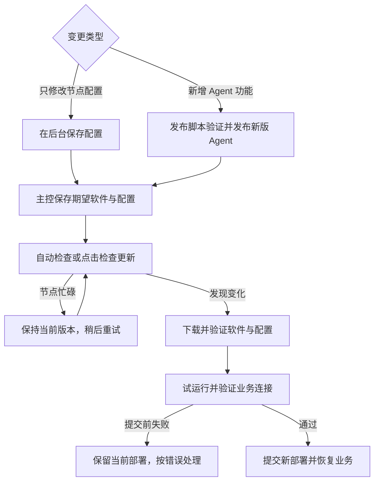

# Akastr Agent 安装与使用教程

本文面向节点操作者。所有参数均在 AkastrCloud 后台填写；后台返回一行版本化安装命令，VPS 执行时不会询问节点名称、模式、WSS、ChangeIP、SOCKS5 或 token。后台中的节点是持久对象：同一命令可用于空白 VPS、覆盖安装或修复，不必先卸载。

## 1. 支持范围

安装环境必须满足：

- Debian 12 或 Debian 13；
- `x86_64` / `amd64`；
- systemd；
- root 用户直接操作；安装和管理命令不依赖 `sudo`；
- 能访问 AkastrCloud HTTPS/WSS 与 GitHub release；Runner 还需访问 GitHub 上固定 commit 的官方 IPQuality 脚本。

不发布 ARM 版本，也不支持 Ubuntu、Alpine、OpenRC、容器或 Windows service。节点不需要 Git、Go、Node.js，也不用手写 JSON 或校验 SHA-256。

先检查主机：

```bash
uname -m
ps -p 1 -o comm=
. /etc/os-release
printf '%s %s\n' "$ID" "$VERSION_ID"
```

预期依次看到 `x86_64`、`systemd`、`debian 12` 或 `debian 13`。如果主机还没有 `curl`：

```bash
apt-get update
apt-get install --yes ca-certificates curl
```

## 2. 在后台填写全部参数

进入 AkastrCloud 后台的“Agent 管理”，选择一种安装类型。

### 目标节点

必须填写节点名称并绑定对应服务器，然后设置：

- 公网 IP 检查间隔：10–300 秒；一般保持 60 秒。Target 同时尝试观察 IPv6，无公网 IPv6 时忽略；
- ChangeIP：不启用、粘贴服务商完整 `curl` 命令，或固定本机程序；
- SOCKS5 入口：不公布，或公布端口。

服务商接口方式直接粘贴完整命令，例如 `curl -X POST -H "Authorization: Bearer …" https://example.com/changeIP/`。后台只接受 HTTPS、POST、一个 Bearer header 和一个 URL，再解析成结构化配置；它不会执行这段文本，也不会把 token 拆成另一个输入框。该 secret 不进入安装命令，最终只存在于 root-only 的当前 configuration revision 目录。

“固定本机程序”填写节点上已有程序或脚本的干净绝对路径，例如 `/usr/local/bin/changeip`。没有参数就保持参数框为空；有参数时每行填写一个。程序必须是 Agent service 可读取的非 symlink regular file 并具有执行权限；脚本需要有效 shebang。它不接受相对路径、控制字符、shell/env/busybox 入口，以及 sandbox 隐藏的 home、runtime user 或临时目录。主控以后只能触发这组固定 argv，不能远程换程序或参数。

公布 SOCKS5 只描述已有代理，Agent 不安装代理服务，也不保存该代理的用户名和密码。只需填写 1–65535 的监听端口；主控始终使用 Agent 最近一次观测到的公网 IPv4，不接受 DDNS、固定主机名或手填 IP。尚未建立公网 IPv4 baseline 时不会派发 IPQuality。

### IPQuality Runner

Runner 不绑定单一服务器。勾选需要检测的目标服务器，逐项填写 SOCKS5 用户名和密码。后台以稳定 server key 生成 1–128 个本地 profile；密码不会进入安装命令、列表、capability、Agent 日志或 command payload。

Runner 固定使用官方 [xykt/IPQuality](https://github.com/xykt/IPQuality)，具体 commit 与 SHA-256 见[安装器](../scripts/install.sh)的 `IPQUALITY_COMMIT` / `IPQUALITY_SHA256`。并发严格为 1，多个检测由 AkastrCloud 持久排队。除作为安装前置的 `curl` 外，安装器只在缺少 Runner 命令时安装 `bash`、`jq`、`bc`、`netcat-openbsd`、`dnsutils` 和 `iproute2`，并在改动本地 Agent 前确认 `/bin/bash`、`jq`、`curl`、`bc`、`nc`、`dig` 与 `ip` 均可执行。

检测次数与缓存由 [Cloud Carpool 契约](https://github.com/akastrmix/AkastrCloud/blob/main/docs/CARPOOL.md#4-changeip-与-ipquality)管理；重装 Runner 或新增 profile 不能绕过限制。

## 3. 添加节点并执行一键命令

点击“添加节点”后，节点会立刻出现在下方列表中，状态为“待安装”，同时显示一键命令。复制完整命令到目标 VPS 执行。命令形态如下，实际安装码由后台填写：

```text
curl -fsSL https://origin.akastrmix.com/agent.sh | sh -s -- '安装码'
```

上面只展示命令结构；实际安装必须完整复制后台生成的命令，不要手工替换占位符。

不要改写、拆分或公开这行命令。`/agent.sh` 不接收安装码，只以不缓存的 302 跳转到 Cloud 当前批准版本的 GitHub Release installer；同一命令重跑会取得当时批准的版本，而非 GitHub latest。命令信任官方 HTTPS 入口及其固定版本 Release 跳转，发布流程验真 installer，installer 内部仍校验 Agent binary 的 SHA-256。

安装码只是 `节点UUID.机器token` 的组合，不是新增凭据或短码兑换服务；脚本拆开后使用原有 HTTPS bootstrap，默认地址为 `https://origin.akastrmix.com/internal/agents/bootstrap`。旧的三个环境变量加 `--install` 仍可使用，显式 bootstrap endpoint 仍优先。机器 token 是长期安装凭据，可能进入 shell history 和安装进程参数；它不会用于 WSS 日常认证。命令不包含 ChangeIP Bearer、SOCKS5 密码或其他 provider secret。

需要修改配置时点击“修改配置”。后台回填完整配置，包括 ChangeIP curl 原文与 Runner 凭据，密码可按需显示；在同一表单修改后保存。内容没有变化时不会更新版本或断开连接；真实修改会保留节点 ID、角色、服务器绑定、机器 token 与 identity，递增 configuration revision，并在新配置应用完成前暂停业务派发。保存时会核对你打开表单时的配置版本；若另一页面已修改，保留当前草稿并提示读取最新配置后重新确认。具体编辑契约见 [Cloud API](https://github.com/akastrmix/AkastrCloud/blob/main/docs/API.md#agent-控制通道)。在线 Agent 会自动进入维护协调；需要立即处理时点击“检查更新”，离线 Agent 则在恢复连接后自动同步，不需要重新执行安装命令。只有人工修复或重装才再次获取同一条一键命令。安装器拒绝覆盖不同节点、所有权不明的残留或降级已装版本；同节点安装复用 identity，残缺状态通过重跑同一命令 fix-forward 收敛。怀疑命令泄露时点击“轮换密钥”，原命令立即失效。

安装过程完全非交互，自动校验程序与脚本、取得密封配置并注册节点；摘要正确的已有制品会复用。它只管理唯一的 `akastr-agent.service`，完成后仍须按第 5 节验收业务连接。内部安装与状态恢复流程见[架构说明](ARCHITECTURE.md#8-fix-forward-安装与自动更新)。

成功时最后显示：

```text
Akastr Agent <release-version> installed successfully.
```

所有下载、bootstrap 校验、依赖准备和首次空闲检查都在停止现有 service 前完成；最终配置物化与 runtime 验证在停止后完成。缺失或损坏的派生凭据文件可以重建，已有 bootstrap 摘要冲突、身份或执行状态损坏仍拒绝自动覆盖。停止后的安装采用 fix-forward：失败不会尝试启动已经被 Cloud 判定为旧 revision 的配置，而是保留已写入的新文件并明确要求修复报错后重跑同一命令。新节点、人工重装和残缺安装使用相同安装收敛路径；普通配置变更使用第 7 节的自动维护流程。

## 4. 文件与权限

主要路径：

```text
/etc/akastr-agent/identity.json
/var/lib/akastr-agent/configurations/<configuration-revision>/
/usr/local/lib/akastr-agent/releases/<release-version>/
/usr/local/lib/akastr-agent/deployments/<release-version>-r<configuration-revision>/
/usr/local/lib/akastr-agent/current
/etc/systemd/system/akastr-agent.service
```

每个 revision 目录包含 `config.json`，HTTP ChangeIP 另含 `changeip-curl.conf`，Runner 另含 `proxy-profiles.json`；Runner 脚本位于 `/usr/local/lib/akastr-agent/ipquality/ip.sh`。固定程序由操作者在节点上管理，安装器不会写入或卸载。配置与 secret 文件权限为 `0600`，配置和状态目录为 root-only。唯一主进程可以写 `/var/lib/akastr-agent` 与自己的 release root；固定程序所在的其他系统目录在 `ProtectSystem=strict` 下只读，home 目录不对 service 开放。

## 5. 安装后验收

在 VPS 执行：

```bash
systemctl is-active akastr-agent.service
systemctl show akastr-agent.service --property=MainPID,ActiveState,SubState,NRestarts
/usr/local/lib/akastr-agent/current/akastr-agent version
/usr/local/lib/akastr-agent/current/akastr-agent check-config --config /usr/local/lib/akastr-agent/current/config/config.json
/usr/local/lib/akastr-agent/current/akastr-agent capabilities --config /usr/local/lib/akastr-agent/current/config/config.json
journalctl -u akastr-agent.service -n 100 --no-pager
```

正确结果是：系统中只有 `akastr-agent.service`，其状态为 `active`、`MainPID` 非 0、版本与后台批准的 release 一致、配置输出 `configuration valid`，日志出现 `control connection ready`。service 的 `active` 表示进程运行，不能单独证明业务连接可用；业务不兼容时仍需保持独立更新能力。SOCKS5 capability 只应包含端口；任何 capability 都不应包含 token、密码、主机名或 provider secret。

再回到后台确认节点为“在线”，版本和类型正确；只有在线且 capability 完整的节点才能接收业务操作。

## 6. 日常使用

Agent 没有供操作者绕过主控的本地换 IP 或 IPQuality 命令。用户从 AkastrCloud/Carpool 发起延迟立即更换、预设更换、自动定时更换和 IPQuality 查询。

自然 IPv4 首次观察通过 WSS `ip.snapshot` 持久建立 Cloud baseline，之后的变化再以 `ip.observed` 上报。AkastrCloud 重置变化后的 IPQuality 缓存代际，并私聊所有仍满足订阅条件的用户；没有 Telegram channel 播报。

常用只读或服务操作：

```bash
systemctl status akastr-agent.service --no-pager
journalctl -u akastr-agent.service -f
systemctl restart akastr-agent.service
```

不要启动第二个 `akastr-agent run`，不要手工重复注册，也不要修改 `identity.json`、operation state 或 IP observation state。

## 7. 更新、状态与卸载

普通配置修改不需要重新运行安装命令。在 Cloud 的添加/编辑表单管理同一套完整参数，curl 原文、脚本路径/参数和 Runner 凭据会回填；Cloud 加密保存，管理员读取时解密，密码可显示。节点上的自定义程序由操作者准备。新增 Agent 功能由维护者先发布软件；两种变更最终都由主控保存为节点的期望软件与配置，再由 Agent 自动协调：



“检查更新”通过独立维护连接唤醒 Agent，已具备稳定维护能力的节点在业务协议不兼容时仍可更新；离线节点需先恢复连接，正在执行任务时等待空闲。点击按钮不代表更新已完成，须核对后台版本、配置应用状态和业务连接。试运行提交前失败时保留旧部署；已提交但确认中断时，由新部署重连完成确认。具体提交顺序见[架构说明](ARCHITECTURE.md#8-fix-forward-安装与自动更新)，消息契约见 [PROTOCOL.md](PROTOCOL.md#自动维护与配置协调)。

```bash
journalctl -u akastr-agent.service -n 100 --no-pager
```

Agent 不提供 `--update` 或本地回退 CLI。失败处理取决于阶段：

- 试运行前的确定性目标拒绝会暂停当前进程对同一目标的重试；修正 Cloud 配置后重新验证。若修复的是节点本地脚本或依赖，可重启 Agent 重新验证；临时失败会延迟重试。
- 每个软件版本/配置版本最多自动试运行两次（首次加一次补试），试运行超时、强制终止或节点重启不重置次数；达到上限后保留旧版本。修复故障后点击“检查更新”可再授权一次尝试，仍须通过完整校验。
- 本地重试记录损坏时需人工修复，按钮不会清除损坏证据。维护身份或本地部署损坏时，重新获取后台当前的一键命令修复；不要猜测目标版本或绕过校验。

制品回收保留当前和上一套部署，不清理身份、业务执行状态或重试证据。安装命令提示维护占用时，等待后重试；具体锁与回收边界见[架构说明](ARCHITECTURE.md#8-fix-forward-安装与自动更新)。

自动维护的范围是 Agent 程序与配置，不会重新运行安装器，也不会自动改写 systemd unit、安装 Debian 依赖包或替换固定 IPQuality 脚本。涉及这些安装内容的版本，由维护者在发布说明中明确已有节点的处理方式；需要收敛时，先在后台取得当前的一键命令，在节点执行同一条安装命令。安装器会检查空闲状态、保留同节点身份，并收敛受管安装。节点上由操作者自行提供的 ChangeIP 程序仍由操作者维护。

日常状态直接从 systemd 读取，不需要再次下载安装器或使用机器 token：

```bash
systemctl --no-pager --full status akastr-agent.service
```

永久卸载必须使用版本化 installer 和显式销毁参数：

```bash
curl -fsSL 'https://github.com/akastrmix/akastr-agent/releases/download/<release-version>/install.sh' | sh -s -- --uninstall --confirm-destroy-local-agent
```

完整 runtime 的卸载会在停止服务前后执行 maintenance-safe 检查；残缺安装没有可执行检查时直接停止唯一 service。随后永久删除该 unit、`/etc/akastr-agent`、`/var/lib/akastr-agent`、`/usr/local/lib/akastr-agent`、private key 和本地执行证据；中途失败直接重跑同一卸载命令。操作者自行管理的固定 ChangeIP 程序不受影响。它不会自动删除后台节点。

## 8. 常见故障

| 现象 | 处理 |
| --- | --- |
| 拒绝系统或架构 | 只支持 Debian 12/13 amd64；不要绕过检测或使用 ARM asset |
| 下载失败并显示 `curl exit code` | 先核对网络/TLS 与版本化 Release 地址；不要改用浮动或 raw 地址 |
| 缺少 `AKASTR_AGENT_*` | 命令被截断或手工改写；回后台重新生成，不要自行拼装 |
| bootstrap 返回 403 | 机器 token 已轮换、节点已删除或 UUID 不匹配；回后台重新取得有效命令 |
| bootstrap authentication failed | 密文、token 或 UUID 不匹配；停止操作，不要尝试绕过认证 |
| `check-config` 报 ChangeIP program | 程序不存在、不是 regular file 或不可执行；先修复固定 provider |
| `change_triggered` | HTTP provider 收到 `200`，或固定程序退出 `0`；只确认触发，主控继续等待公网 IP 事实 |
| `change_trigger_unknown` | 换 IP 可能让响应、进程或 WSS 提前断开；Agent 不重发 provider，恢复后由常驻 IPv4 monitor 收敛 |
| `http_status_not_200` / `exited_nonzero` | 服务商返回非 `200`，或固定程序非零退出；先修复 provider，Agent 不把它当成已触发 |
| IPQuality 脚本校验失败 | 停止安装；不要更改 checksum 或使用浮动在线脚本 |
| `proxy_profile_not_found` | Runner 未配置该目标 server key；删除后按完整 profile 重新添加 Runner 节点 |
| `proxy_preflight_failed` / `proxy_postflight_failed` | 检查目标 SOCKS5 host、端口、凭据和代理稳定性，不要打印密码 |
| `runner_busy` | Runner 单执行槽正忙，应由主控排队 |
| enrollment 返回 `agent_node_busy` / HTTP 409 | 主控仍有 pending、offered、accepted command 或 active ChangeIP session；等待其终结后重新运行同一安装命令 |
| enrollment 返回 `agent_release_required` | 安装命令引用的 binary 不是主控当前批准 release；回后台重新获取命令 |
| enrollment 返回 `agent_configuration_stale` | 配置在本次注册期间又被修改；运行中的 Agent 点击“检查更新”或等待自动协调，安装过程则重新运行同一条后台一键命令以取得最新 revision |
| service 启动超时 | WSS auth 或 hello 未完成；查看唯一主 service 日志，修复主控、网络或 identity 问题后重跑同一安装命令 |
| service 反复重启 | 查看 `systemctl show`、`journalctl` 并运行 `check-config`；不要删除 state 逃避错误 |
| 日志出现 `maintenance_reconciliation_failed` | 主控、网络、软件校验或配置物化失败；若日志显示 trial 已提交，则由新 `current` 重连收敛，否则旧 `current` 保持生效；查看相邻日志并修复根因 |
| 日志出现 `update_cleanup_failed` | 新 deployment 已提交，但未引用的 deployment/release/configuration 未完全清理；current/previous 不受影响，检查文件权限或磁盘 |

## 9. 维护者发布版本

正式发布的命令、前置条件、CI 验真与重跑流程统一见 [Cloud 更新指南](https://github.com/akastrmix/AkastrCloud/blob/main/docs/UPDATE_GUIDE.md#5-发布范围)。已具备稳定维护能力的节点在同协议或破坏性业务协议发布后，通过独立维护通道自动更新，也可在后台点击“检查更新”，不要求逐节点重装。若稳定维护认证、下载目标或 candidate CLI 本身不兼容，须另行批准重新接入方案。不要绕过同步发布器手工打标签或修改 Cloud pin。

每个版本使用独立的 `releases/download/vX.Y.Z/...` 地址。只有同步流程中的 Cloud backend 激活成功，主进程的六小时循环才会收到 `update_available`；系统不跟随 GitHub `latest`。发布动作不会创建节点或触发 ChangeIP/IPQuality。
